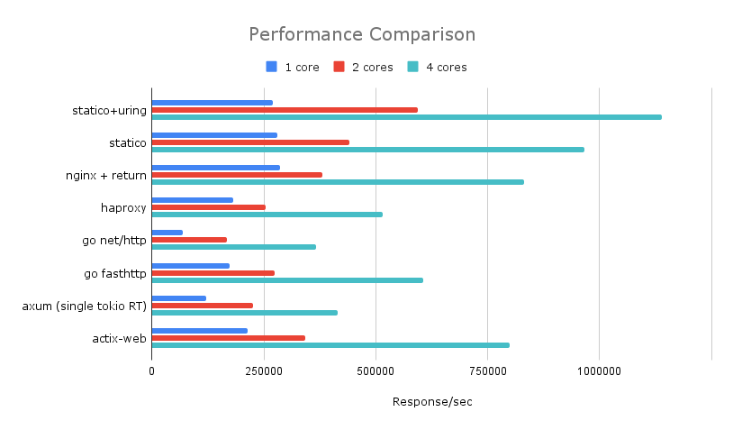

# Statico

A high-performance HTTP webserver implemented in Rust that serves static responses at the speed of light.
Its sole purpose is to handle HTTP requests as fast as possible; as such, it is neither a full-featured 
HTTP server nor an HTTP router, and it is not intended for production use beyond benchmarking.

## Features

- **Multi-threaded**: Configurable number of worker threads
- **Single-threaded Tokio runtime per thread**: Each worker thread runs its own Tokio current-thread runtime
- **SO_REUSEPORT**: Multiple threads can bind to the same port for load balancing 
- **Configurable responses**: Set custom HTTP status codes, headers, and response body
- **File-based responses**: Load response body from files using `@filename` syntax
- **Optional io_uring support**: Experimental support for io_uring on Linux (compile-time feature)
- **Cross-platform**: Works on Linux, macOS, Windows, and other Unix-like systems

## Performance

The following benchmark compares Statico against other popular HTTP servers and frameworks in a synthetic scenario where each server returns a minimal static response from memory. All servers were configured for maximum performance (no logging, CPU pinning where applicable, in-memory responses).



### Benchmark Results (requests/second)

| Server | 1 thread | 2 threads | 4 threads |
|--------|----------|-----------|-----------|
| **statico + io_uring** | 270,263 | 593,067 | 1,138,319 |
| **statico** | 279,842 | 441,117 | 966,248 |
| nginx (return) | 286,960 | 379,974 | 832,082 |
| HAProxy | 181,127 | 253,796 | 515,162 |
| Go net/http | 69,212 | 168,220 | 366,084 |
| Go fasthttp | 172,359 | 273,395 | 605,603 |
| Axum (Rust) | 121,680 | 224,712 | 414,640 |
| actix-web (Rust) | 213,756 | 343,037 | 798,809 |

### Notes on the benchmark setup

- **nginx**: Configured for maximum performance with logging disabled, CPU pinning, and returning a response directly from an in-memory buffer (no disk I/O).
- **HAProxy**: Same optimizations as nginx — no logging, CPU pinning, in-memory response.
- **Go net/http**: A minimal HTTP server using Go's standard library, always returning `200 OK`.
- **Go fasthttp**: Same as net/http but using the high-performance [fasthttp](https://github.com/valyala/fasthttp) library.
- **Axum**: A Rust web framework example using a single multi-threaded Tokio runtime (with 1, 2, or 4 worker threads).
- **actix-web**: A Rust web framework example with configurable thread count (with 1, 2, or 4 threads).

### Key observations

1. **Statico with io_uring scales exceptionally well** — at 4 threads it achieves over 1.1 million req/s, outperforming all other solutions by a significant margin.
2. **Single-thread performance**: Standard Statico and nginx perform similarly (~280k req/s), but Statico pulls ahead as thread count increases due to better multi-core scaling.
3. **Multi-thread scaling**: Statico with io_uring shows near-linear scaling (2.1x at 2 threads, 4.2x at 4 threads), while nginx and others show diminishing returns.
4. **Rust frameworks comparison**: Statico outperforms both Axum and actix-web significantly, demonstrating the benefit of its specialized architecture (per-thread Tokio runtimes + SO_REUSEPORT).
5. **Go comparison**: Even fasthttp, known for its performance, reaches only ~53% of Statico+io_uring throughput at 4 threads.

### Why is Statico fast?

- Minimal request processing overhead
- Efficient multi-threading with SO_REUSEPORT load balancing
- Single-threaded Tokio runtimes reduce context switching
- Zero-allocation response serving (responses are pre-built and cached)
- File content loaded once at startup for optimal performance
- Use io_uring, achieving up to 40% better performance than the basic version on Linux

## Building

### Standard build:
```bash
cargo build --release
```

### With io_uring support (Linux only):
```bash
cargo build --release --features io_uring
```

## Usage

```bash
./target/release/statico [OPTIONS]
```

### Command Line Options

| Option | Description |
|--------|-------------|
| `-t, --threads <THREADS>` | Number of worker threads to spawn (default: 12) |
| `-p, --port <PORT>` | Port to listen on (default: 8080) |
| `-a, --address <ADDRESS>` | Address to listen on. If not specified, listen on all interfaces |
| `-s, --status <STATUS>` | HTTP status code to return (default: 200) |
| `-b, --body <BODY>` | Response body content (optional). Use `@filename` to load from file |
| `--header <HEADER>` | Custom headers in "Name: Value" format (can be specified multiple times) |
| `--http2` | Enable HTTP/2 (h2c) support |
| `--receive-buffer-size <SIZE>` | Receive buffer size |
| `--send-buffer-size <SIZE>` | Send buffer size |
| `--listen-backlog <SIZE>` | Listen backlog queue |
| `--tcp-nodelay` | Set TCP_NODELAY option |
| `--uring` | Use io_uring (Linux only, requires `io_uring` feature) |
| `--uring-entries <SIZE>` | Size of the io_uring Submission Queue (SQ) (default: 4096) |
| `--uring-sqpoll <MS>` | Enable kernel-side submission polling with idle timeout in milliseconds |
| `-h, --help` | Print help |
| `-V, --version` | Print version |

## Examples

### Basic usage
Start a server on port 8080 with default settings:
```bash
./target/release/statico
```

### Custom port and threads
```bash
./target/release/statico --port 3000 --threads 4
```

### Serve custom content with headers
```bash
./target/release/statico \
  --status 201 \
  --body "Hello, World!" \
  --header "Content-Type: text/plain" \
  --header "X-Custom-Header: MyValue"
```

### Serve JSON response
```bash
./target/release/statico \
  --status 200 \
  --body '{"message": "Hello from Statico!", "timestamp": "2024-01-01T00:00:00Z"}' \
  --header "Content-Type: application/json" \
  --header "Cache-Control: no-cache"
```

### Error response simulation
```bash
./target/release/statico \
  --status 404 \
  --body "Not Found" \
  --header "Content-Type: text/plain"
```

### Load testing setup
```bash
# Start server with many threads for high concurrency
./target/release/statico \
  --threads 16 \
  --port 8080 \
  --body "OK" \
  --header "Content-Type: text/plain"
```

### With io_uring (Linux only)
```bash
# Requires compilation with --features io_uring
./target/release/statico --uring --threads 8
```

### Serve content from files
```bash
# Serve JSON response from file
./target/release/statico \
  --body @response.json \
  --header "Content-Type: application/json"

# Serve HTML page from file
./target/release/statico \
  --body @index.html \
  --header "Content-Type: text/html"

# Serve any file content
./target/release/statico \
  --body @data.xml \
  --header "Content-Type: application/xml"
```

## Architecture

### Threading Model
- The main thread parses command line arguments and spawns worker threads
- Each worker thread creates its own socket bound to the same port using SO_REUSEPORT
- Each worker thread runs a single-threaded Tokio runtime (`current_thread`)
- The kernel load-balances incoming connections across threads

### Socket Reuse
- **Linux/Android**: Uses `SO_REUSEPORT` for true load balancing across threads
- **Other Unix systems**: Falls back to `SO_REUSEADDR` (connections handled by one thread)
- **Windows**: Uses `SO_REUSEADDR`

### io_uring Support (Linux only)
The `io_uring` feature provides experimental support for Linux's io_uring interface:
- Compile with `--features io_uring`
- Run with `--uring` flag
- Configure the submission queue size with `--uring-entries` (default: 4096)
- Enable kernel-side polling with `--uring-sqpoll <timeout_ms>` 
- Currently provides a simplified implementation (only HTTP/1.1 is supported)

## Use Cases

- **Load testing**: Generate consistent HTTP responses for testing client applications
- **Mocking services**: Simulate API endpoints with specific status codes and responses
- **Static file serving**: Serve static content from files without a full web server
- **Health checks**: Provide simple health check endpoints
- **Benchmarking**: Test HTTP client performance with minimal server overhead
- **Development**: Quick HTTP server for development and testing scenarios

## Testing

Test the server with curl:
```bash
# Basic test
curl http://localhost:8080

# With verbose output to see headers
curl -v http://localhost:8080

# Load test with Apache Bench
ab -n 10000 -c 100 http://localhost:8080/
```

## License

This project is provided as-is for educational and practical use.
