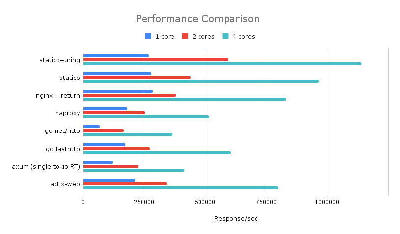

# Statico

A blazing-fast HTTP server in Rust for serving static responses. Designed strictly for benchmarking with minimal overhead.

## Features

- **Multi-threaded** with configurable worker threads
- **Per-thread Tokio runtime** (single-threaded) for reduced context switching
- **SO_REUSEPORT** for kernel-level load balancing across threads
- **Configurable responses**: custom status codes, headers, and body
- **File-based responses** via `@filename` syntax
- **Optional io_uring support** on Linux (compile-time feature)
- **Cross-platform**: Linux, macOS, Windows

## Performance

The following benchmark compares Statico against other popular HTTP servers and frameworks in a synthetic scenario where each server returns a minimal static response from memory. All servers were configured for maximum performance (no logging, CPU pinning where applicable, in-memory responses).



### Benchmark Results (requests/second)

| Server | 1 thread | 2 threads | 4 threads |
|--------|----------|-----------|-----------|
| **statico + io_uring** | 270,263 | 593,067 | 1,138,319 |
| **statico** | 279,842 | 441,117 | 966,248 |
| nginx (return) | 286,960 | 379,974 | 832,082 |
| HAProxy | 181,127 | 253,796 | 515,162 |
| Go net/http | 69,212 | 168,220 | 366,084 |
| Go fasthttp | 172,359 | 273,395 | 605,603 |
| Axum (Rust) | 121,680 | 224,712 | 414,640 |
| actix-web (Rust) | 213,756 | 343,037 | 798,809 |

**Key observations:**
- Statico with io_uring achieves **1M+ req/s at 4 threads** with near-linear scaling
- Standard Statico and nginx perform similarly single-threaded, but Statico scales better
- Outperforms Axum, actix-web, and Go's fasthttp significantly at higher thread counts

*Note: "statico + io_uring" uses `tokio-uring`. Other io_uring runtimes (`monoio`, `glommio`) may show even better performance.*

### Why is Statico fast?

- Zero-allocation response serving (pre-built cached responses)
- Single-threaded Tokio runtimes per worker reduce contention across cores 
- SO_REUSEPORT for efficient kernel load balancing
- File content loaded once at startup
- io_uring support on Linux (up to 40% faster)

## Building

```bash
# Standard build
cargo build --release

# With specific runtimes (each requires its own feature)
cargo build --release --features tokio_uring  # tokio-uring runtime
cargo build --release --features monoio       # monoio runtime
cargo build --release --features glommio      # glommio runtime
cargo build --release --features smol         # smol runtime
cargo build --release --all-features          # enable all runtimes 
```

## Usage

```bash
./target/release/statico [OPTIONS]
```

### Options

| Option | Description |
|--------|-------------|
| `-t, --threads <THREADS>` | Number of worker threads to spawn (default: number of CPUs) |
| `-p, --ports <PORTS>` | Ports to listen on, supports ranges (e.g., `8080`, `8080,8100-8200`) (default: 8080) |
| `--bind-all` | Each thread binds to all specified ports (default: ports are balanced across threads) |
| `-a, --address <ADDRESS>` | Address to listen on. If not specified, listen on all interfaces |
| `-s, --status <STATUS>` | HTTP status code to return (default: 200) |
| `-b, --body <BODY>` | Response body content (optional). Use `@filename` to load from file |
| `-H, --header <HEADER>` | Custom headers in "Name: Value" format (can be specified multiple times) |
| `-d, --delay <DELAY>` | Delay before sending the response (e.g., `100ms`, `1s`, `500us`) |
| `--body-delay <DELAY>` | Delay before sending the body of the response (e.g., `100ms`, `1s`, `500us`) |
| `-m, --meter` | Enable real-time metrics monitoring (requests/sec, bandwidth) |
| `-v, --verbose` | Increase verbosity level (can be repeated: `-v`, `-vv`, `-vvv`, `-vvvv`) |
| `--http2` | Enable HTTP/2 (h2c) support |
| `--runtime <RUNTIME>` | Runtime to use: `tokio`, `tokio-local`, `smol`, `tokio-uring`, `monoio`, `glommio` (default: tokio) |
| `--receive-buffer-size <SIZE>` | Receive buffer size |
| `--send-buffer-size <SIZE>` | Send buffer size |
| `--listen-backlog <SIZE>` | Listen backlog queue |
| `--tcp-nodelay` | Set TCP_NODELAY option |
| `--uring-entries <SIZE>` | Size of the io_uring Submission Queue (SQ) (default: 4096, Linux only) |
| `--uring-sqpoll <MS>` | Enable kernel-side submission polling with idle timeout in milliseconds (Linux only) |
| `-h, --help` | Print help |
| `-V, --version` | Print version |

## Examples

```bash
# Basic server on port 8080
./target/release/statico

# Custom port and threads
./target/release/statico --ports 3000 --threads 4

# Multiple ports and ranges
./target/release/statico --ports 8080,8443,9000-9010

# Bind all threads to all ports (SO_REUSEPORT load balancing)
./target/release/statico --ports 8080,8081 --threads 4 --bind-all

# Custom response with headers
./target/release/statico --status 201 --body "Hello" -H "Content-Type: text/plain"

# Multiple headers
./target/release/statico -H "Content-Type: application/json" -H "X-API-Key: secret"

# JSON response
./target/release/statico -b '{"msg": "hi"}' -H "Content-Type: application/json"

# Serve from file
./target/release/statico --body @response.json -H "Content-Type: application/json"

# io_uring runtimes (Linux only, requires feature flags)
./target/release/statico --runtime tokio-uring --threads 8
./target/release/statico --runtime monoio --threads 8
./target/release/statico --runtime glommio --threads 8

# Add delay (latency simulation)
./target/release/statico --delay 100ms

# Delay body only (headers sent immediately)
./target/release/statico --body-delay 500ms

# Verbose logging (levels: -v, -vv, -vvv, -vvvv)
./target/release/statico -vv

# Real-time metrics
./target/release/statico --meter
```

## Architecture

### Threading Model
- Main thread parses arguments and spawns workers
- Each worker creates its own socket with SO_REUSEPORT
- Each worker runs a single-threaded Tokio runtime
- Kernel load-balances connections across threads via reuse port 

### Runtimes

| Runtime | Feature Flag | Notes |
|---------|--------------|-------|
| `tokio` (default) | - | Single-threaded runtimes |
| `tokio-local` | - | Uses `LocalSet` |
| `smol` | `smol` | Alternative async runtime |
| `tokio-uring` | `tokio_uring` | io_uring support |
| `monoio` | `monoio` | io_uring (potentially faster) |
| `glommio` | `glommio` | io_uring (potentially faster) |

*Note: io_uring and smol runtimes support HTTP/1.1 only.*

## Use Cases

- **Load testing** and **benchmarking** HTTP clients
- **Mocking services** and API endpoints
- **Static file serving** without full web server overhead
- **Health check** endpoints
- **Development** and testing scenarios

## License

Provided as-is for educational and practical use.
