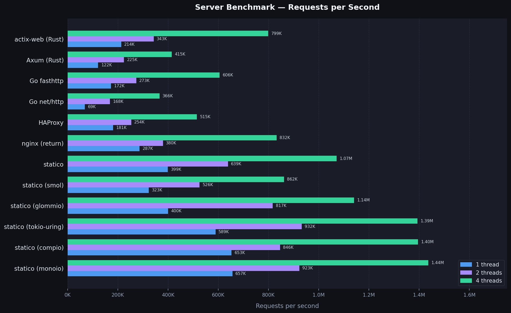

# Statico

A blazing-fast HTTP server in Rust for serving static responses. Designed strictly for benchmarking with minimal overhead.

## Features

- **Multi-threaded** with configurable worker threads
- **Per-thread Tokio runtime** (single-threaded) for reduced context switching
- **SO_REUSEPORT** for kernel-level load balancing across threads
- **Configurable responses**: custom status codes, headers, and body
- **File-based responses** via `@filename` syntax
- **Optional io_uring support** on Linux (compile-time feature)
- **mimalloc allocator** by default for reduced memory allocation overhead
- **Cross-platform**: Linux, macOS, Windows

## Performance

The following benchmark compares Statico against other popular HTTP servers and frameworks in a synthetic scenario where each server returns a minimal static response from memory. All servers were configured for maximum performance (no logging, CPU pinning where applicable, in-memory responses).



### Benchmark Results (requests/second)

| Server | 1 thread | 2 threads | 4 threads |
|--------|----------|-----------|-----------|
| **statico (monoio) ** | 656,517 | 922,825  | 1,358,045 |
| **statico (tokio-uring) ** | 589,086 | 932,143 | 1,393,573 |
| **statico (glommio) ** | 400,036 | 816,936 | 1,140,535|
| **statico (compio) ** | 503,854 | 845,768 | 1,274,065 |
| **statico (smol) ** | 323,267 | 525,824 | 771,202 |
| **statico** | 399,025 | 638,767 | 1,071,433 |
| nginx (return) | 286,960 | 379,974 | 832,082 |
| HAProxy | 181,127 | 253,796 | 515,162 |
| Go net/http | 69,212 | 168,220 | 366,084 |
| Go fasthttp | 172,359 | 273,395 | 605,603 |
| Axum (Rust) | 121,680 | 224,712 | 414,640 |
| actix-web (Rust) | 213,756 | 343,037 | 798,809 |

**Key observations:**
- All four io_uring runtimes exceed **1.1M+ req/s at 4 threads**: `tokio-uring` leads at 1.39M, followed by `monoio` (1.36M), `compio` (1.27M), and `glommio` (1.14M)
- `compio` and `glommio` show super-linear scaling (2.5× and 2.85× respectively from 1→4 threads), suggesting better CPU cache utilisation at higher parallelism
- io_uring runtimes are **27–64% faster** than standard Tokio: at 1 thread `monoio` is ~64% ahead (656K vs 399K req/s); the gap narrows but persists at 4 threads (~30%)
- Standard Statico already outperforms nginx by ~40% single-threaded (399K vs 287K req/s) and scales significantly better at higher thread counts
- At 4 threads the top io_uring runtimes outperform Go fasthttp by **2.3×**, actix-web by **1.7×**, and Axum by **3.4×**

### Why is Statico fast?

- **mimalloc** as the default global allocator reduces memory allocation overhead
- Single-threaded Tokio runtimes per worker reduce contention across cores
- SO_REUSEPORT for efficient kernel load balancing
- File content loaded once at startup; body bytes cached as reference-counted `Bytes`
- io_uring runtimes pre-encode the full HTTP response (headers + body) once at startup — zero allocation per request
- io_uring runtimes handle HTTP pipelining: multiple requests parsed and answered in a single syscall round-trip
- io_uring support on Linux (up to 40% faster)
- glommio pins each worker thread to a dedicated CPU core for cache locality

## Building

```bash
# Standard build (mimalloc enabled by default)
cargo build --release

# With specific runtimes (each requires its own feature flag)
cargo build --release --features tokio_uring  # tokio-uring runtime
cargo build --release --features monoio       # monoio runtime
cargo build --release --features glommio      # glommio runtime
cargo build --release --features smol         # smol runtime
cargo build --release --features full         # all runtimes + mimalloc (named feature)
cargo build --release --all-features          # all runtimes + mimalloc (cargo flag)
```

## Usage

```bash
./target/release/statico [OPTIONS]
```

### Options

| Option | Description |
|--------|-------------|
| `-t, --threads <THREADS>` | Number of worker threads to spawn (default: number of CPUs) |
| `-p, --ports <PORTS>` | Ports to listen on, supports ranges (e.g., `8080`, `8080,8100-8200`) (default: 8080) |
| `--bind-all` | Each thread binds to all specified ports (default: ports are balanced across threads) |
| `-a, --address <ADDRESS>` | Address to listen on. If not specified, listen on all interfaces |
| `-s, --status <STATUS>` | HTTP status code to return (default: 200) |
| `-b, --body <BODY>` | Response body content (optional). Use `@filename` to load from file |
| `-H, --header <HEADER>` | Custom headers in "Name: Value" format (can be specified multiple times) |
| `-d, --delay <DELAY>` | Delay before sending the response (e.g., `100ms`, `1s`, `500us`) |
| `--body-delay <DELAY>` | Delay before sending the body only — HTTP headers are flushed immediately (e.g., `100ms`, `1s`, `500us`). Supported by `tokio`, `tokio-local`, and `smol` runtimes. |
| `-m, --meter` | Enable real-time metrics: prints `req/s`, `req Gbps`, `res/s`, `res Gbps` every second. On exit (Ctrl+C) prints totals and, when multiple ports are used, per-port statistics. |
| `-v, --verbose` | Increase verbosity (can be repeated; supported by `tokio`, `tokio-local`, and `smol` runtimes): |
| | `-v` — request line + response status line |
| | `-vv` — + request/response headers |
| | `-vvv` — + body (readable text; non-printable bytes shown as inline hex) |
| | `-vvvv` — + body as full hexdump |
| `--http2` | Enable HTTP/2 (h2c) support (not supported with io_uring or smol runtimes) |
| `--runtime <RUNTIME>` | Runtime to use: `tokio`, `tokio-local`, `smol`, `tokio-uring`, `monoio`, `glommio`, `compio` (default: tokio) |
| `--receive-buffer-size <SIZE>` | Receive buffer size |
| `--send-buffer-size <SIZE>` | Send buffer size |
| `--listen-backlog <SIZE>` | Listen backlog queue |
| `--tcp-nodelay` | Set TCP_NODELAY option |
| `--uring-entries <SIZE>` | Size of the io_uring Submission Queue (SQ) (default: 4096, Linux only) |
| `--uring-sqpoll <MS>` | Enable kernel-side submission polling with idle timeout in milliseconds (Linux only) |
| `-h, --help` | Print help |
| `-V, --version` | Print version |

## Examples

```bash
# Basic server on port 8080
./target/release/statico

# Custom port and threads
./target/release/statico --ports 3000 --threads 4

# Multiple ports and ranges
./target/release/statico --ports 8080,8443,9000-9010

# Bind all threads to all ports (SO_REUSEPORT load balancing)
./target/release/statico --ports 8080,8081 --threads 4 --bind-all

# Custom response with headers
./target/release/statico --status 201 --body "Hello" -H "Content-Type: text/plain"

# Multiple headers
./target/release/statico -H "Content-Type: application/json" -H "X-API-Key: secret"

# JSON response
./target/release/statico -b '{"msg": "hi"}' -H "Content-Type: application/json"

# Serve from file
./target/release/statico --body @response.json -H "Content-Type: application/json"

# io_uring runtimes (Linux only, requires feature flags)
./target/release/statico --runtime tokio-uring --threads 8
./target/release/statico --runtime monoio --threads 8
./target/release/statico --runtime glommio --threads 8
./target/release/statico --runtime compio --threads 8

# Add delay (latency simulation)
./target/release/statico --delay 100ms

# Delay body only (headers sent immediately, then body after delay)
./target/release/statico --body-delay 500ms

# Verbose logging
./target/release/statico -v      # request/response line only
./target/release/statico -vv     # + headers
./target/release/statico -vvv    # + body (text)
./target/release/statico -vvvv   # + body (hexdump)

# Real-time metrics (req/s, Gbps); final report printed on Ctrl+C
./target/release/statico --meter

# Real-time metrics with per-port breakdown on exit
./target/release/statico --ports 8080,8081 --meter
```

## Architecture

### Threading Model
- Main thread parses arguments and spawns workers
- Each worker creates its own socket with SO_REUSEPORT
- Each worker runs a single-threaded runtime (Tokio, smol, or io_uring-based)
- Kernel load-balances connections across threads via SO_REUSEPORT

### Runtimes

| Runtime | Feature Flag | Notes |
|---------|--------------|-------|
| `tokio` (default) | — | Single-threaded Tokio runtime per worker; supports HTTP/1.1 and HTTP/2, verbose, body-delay |
| `tokio-local` | — | Like `tokio` but uses `LocalSet`; same feature set |
| `smol` | `smol` | Alternative async runtime via smol-hyper; supports HTTP/1.1 only; supports verbose and body-delay |
| `tokio-uring` | `tokio_uring` | io_uring; pre-built responses; HTTP pipelining; HTTP/1.1 only |
| `monoio` | `monoio` | io_uring; pre-built responses; HTTP pipelining; HTTP/1.1 only |
| `glommio` | `glommio` | io_uring; pre-built responses; HTTP pipelining; HTTP/1.1 only; **CPU-pinned** (one core per thread) |
| `compio` | `compio` | io_uring; pre-built responses; HTTP pipelining; HTTP/1.1 only; **CPU-pinned** (one core per thread) |

> **Note:** `tokio-uring`, `monoio`, `glommio` and `compio` are Linux-only and require the corresponding feature flags at compile time.

### Pre-built responses (io_uring runtimes)

`tokio-uring`, `monoio`, `glommio` and `compio` encode the full HTTP response — status line, headers, and body — into a single byte buffer once at startup. Every subsequent request reuses that buffer without any allocation or serialization overhead.

The `tokio` and `smol` runtimes assemble the response per-connection using Hyper, caching only the body bytes as a reference-counted `Bytes` value.

## Use Cases

- **Load testing** and **benchmarking** HTTP clients
- **Mocking services** and API endpoints
- **Static file serving** without full web server overhead
- **Health check** endpoints
- **Development** and testing scenarios

## License

MIT OR Apache-2.0
